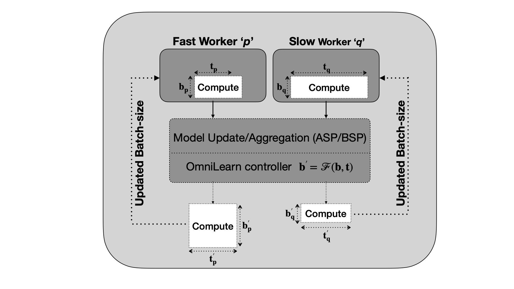
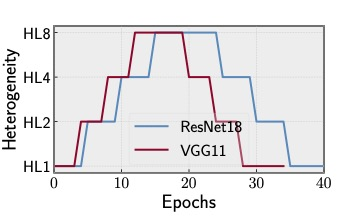
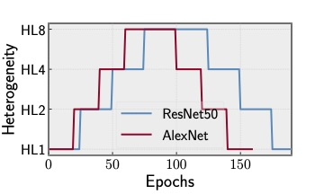

<div align="center">

# $\texttt{OmniLearn}$ : A Framework for Distributed Deep Learning over Heterogeneous Clusters

Implementation of [$\texttt{OmniLearn}$](https://sahiltyagi4.github.io/files/omnilearn.pdf), accepted in _IEEE Transactions on Parallel and Distributed Systems ([TPDS](https://ieeexplore.ieee.org/xpl/RecentIssue.jsp?punumber=71))_, 2025.



</div>

$\textbf{Problem}$: Nodes/devices with heterogeneous compute capabilities have varying performance costs. In 
$\textit{bulk-synchronous parallel}$ or BSP training, this may result in $\textit{straggler slowdown}$ as fast workers must 
wait for slower ones to complete its updates. On the other hand, $\textit{asynchronous-parallel}$ or ASP training suffers
from $\textit{staleness}$ in model updates as progress made by faster workers is exacerbated by slow nodes.

$\textbf{Solution}$: Initially, fast and slow workers (p, q) train on the same mini-batch size $b_{p} = b_{q}$ (breadth of 
'Compute' block) that leads to stragglers (BSP) or staleness (ASP) as compute times $t_{p} < t_{q}$ (length of 'Compute'). 
Controller adjusts mini-batches to equalize compute times, i.e., $t_{p}^{'} \approx t_{p}^{'}$ : $b_{p}^{'} > b_{q}^{'}$ 
since p > q from a computational standpoint.

## Docker installation and container deployment
- To emulate compute nodes with varying heterogeneity, install docker as follows:
  ```
  git clone https://github.com/sahiltyagi4/OmniLearn
  cd OmniLearn
  chmod a+x docker_install.sh
  ./docker_install.sh
  ```
  
- Create a docker swarm network to enable communication between nodes:
  ```
  // for multi-node container deployment and communication
  // run this on one of the host servers. If using only a single node, set the IP address to 127.0.0.1
  docker swarm init --advertise-addr **server ip-address**
  // run docker swarm join command returned by the above on the remaining nodes
  // create docker swarm network named `omninet'
  docker network create --driver overlay --attachable omninet
  ```

- Build a docker image with installed dependencies, spawn containers from ```Dockerfile```.
  ```
  cd OmniLearn/
  // create docker image named omnilearn-image with version tag v1.0
  docker build -t omnilearn-image:v1.0 .
  // check if docker image is built
  docker images
  
  // spawns 4 containers with HL1 over a 48-core CPU for BSP training
  docker run -i --name worker1 --cpuset-cpus 0-11 --memory 16g --shm-size 2g --net omninet -d omnilearn-image:v1.0 /bin/bash
  docker run -i --name worker2 --cpuset-cpus 12-23 --memory 16g --shm-size 2g --net omninet -d omnilearn-image:v1.0 /bin/bash
  docker run -i --name worker3 --cpuset-cpus 24-35 --memory 16g --shm-size 2g --net omninet -d omnilearn-image:v1.0 /bin/bash
  docker run -i --name worker4 --cpuset-cpus 36-47 --memory 16g --shm-size 2g --net omninet -d omnilearn-image:v1.0 /bin/bash
  
  // OR create containers with HL1 for ASP training. Container 'aspworker1' is the parameter server and rest are training workers
  docker run -i --name aspworker1 --cpuset-cpus 0-7 --memory 16g --shm-size 2g --net omninet -d omnilearn-image:v1.0 /bin/bash
  docker run -i --name aspworker2 --cpuset-cpus 8-17 --memory 16g --shm-size 2g --net omninet -d omnilearn-image:v1.0 /bin/bash
  docker run -i --name aspworker3 --cpuset-cpus 18-27 --memory 16g --shm-size 2g --net omninet -d omnilearn-image:v1.0 /bin/bash
  docker run -i --name aspworker4 --cpuset-cpus 28-37 --memory 16g --shm-size 2g --net omninet -d omnilearn-image:v1.0 /bin/bash
  docker run -i --name aspworker5 --cpuset-cpus 38-47 --memory 16g --shm-size 2g --net omninet -d omnilearn-image:v1.0 /bin/bash
  ```

## Job deployment

### Emulating heterogeneity across containers
- Heterogeneity is introduced by varying the cpu-cores allocated to a container.
- Dynamic heterogeneity simulations at various HLs in ResNet18, ResNet50, AlexNet, VGG11 and GPT-2 is implemented 
  in ```pytorch/helper/dynamicbatching/DynamicHeterogeneityEmulator``` class.
  
   | HL             | Method      | <center>Container #1 CPU-cores | <center>Container #2 CPU-cores | <center>Container #3 CPU-cores | <center>Container #4 CPU-cores  |
   |----------------|-------------|--------------------------------|--------------------------------|--------------------------------|---------------------------------|
   | $\textit{HL1}$ | <center>BSP | <center>12                     | <center>12                     | <center>12                     | <center>12                      |
   | $\textit{HL1}$ | <center>ASP | <center>10                     | <center>10                     | <center>10                     | <center>10                      |
   | $\textit{HL2}$ | <center>BSP | <center>12                     | <center>12                     | <center>8                      | <center>16                      |
   | $\textit{HL2}$ | <center>ASP | <center>8                      | <center>8                      | <center>8                      | <center>16                      |
   | $\textit{HL4}$ | <center>BSP | <center>9                      | <center>9                      | <center>6                      | <center>24                      |
   | $\textit{HL4}$ | <center>ASP | <center>10                     | <center>10                     | <center>4                      | <center>16                      |
   | $\textit{HL8}$ | <center>BSP | <center>6                      | <center>6                      | <center>4                      | <center>32                      |
   | $\textit{HL8}$ | <center>ASP | <center>4                      | <center>4                      | <center>4                      | <center>28                      |

- ```DynamicHeterogeneityEmulator``` works by allocating cpu-sets to 4 worker containers, as per the above table. Users can change the number of nodes or degree of heterogeneity with ```container_cpuconf``` dictionary.
- To emulate dynamic heterogeneity across the 4 containers, execute ```dynamicbatching.py``` on the host server(s) running the containers:
  
  ```
  cd OmniLearn/scripts
  chmod a+x exec_HL.sh
  // specify arguments for the script. The first specifies the total number of running containers
  // Second argument points to the directory location where the cpu-log files are present on host server.
  // For e.g., 4 containers logging in /logs directory of the server
  ./exec_HL.sh 4 /logs
  ```
  
  <div align="center">
    
    
  </div>

- The specific core allocations allotted to each container in our experiments can be found in [cpus_allocation.md](cpus_allocation.md).
- The emulator triggers HLs for the above models (as well as for GPT-2 following the same trajectory as ResNet18)
  at different epochs as shown in the plots. Whenever a $\textit{HL}$ change is triggered, a container writes 
  the new CPU configuration to its corresponding ```cpu-**worker_rank**.log``` file. The ```HeterogeneityToggle```
  class executes function ```toggle_containerCPUs``` on the host server (running the containers) with ```scripts/exec_HL.sh```, and takes the
  argument ```server_logdir```. *Make sure ```server_logdir``` is in the same directory as ```dir``` argument in 
  ```run_omnilearnBSP.py``` and ```run_omnilearnASP.py```*. This can be done by mounting the host directory in the
  container's logging directory during container creation. For e.g., ```/logs``` directory on host server
  can be mounted to be the same as ```/logs``` on the containers.

    ```
    docker run -i -v /logs:/logs --name worker1 --cpuset-cpus 0-11 --memory 16g --shm-size 2g --net omninet -d omnilearn-image:v1.0 /bin/bash
   ```
  
- The ```toggle_containerCPUs``` function constantly scans the worker cpu-log files to check for updates, and
  executes the latest configuration via subprocess that runs:
    ```
  docker update --cpuset-cpus *new cpu-cores* *container-name*
  // for example changing to HL8 in BSP over container 'worker1'
  docker update --cpuset-cpus 0-5 worker1
  ```

### Launch training jobs

- **Synchronous Training (BSP)**: ```pytorch/dynamic_controller/run_omnilearn_BSP.py``` trains in a heterogeneity-aware manner
  over a synchronous communication-model. The file uses ```--bsp``` argument for BSP which is used by the
  ```data-partitioner.py``` and ```dynamicbatching.py```. BSP-based OmniLearn is deployed by running 
  ```scripts/omnilearnBSP.sh``` from the host server once the containers the running.
- **Asynchronous Training (ASP)**: Specifies argument ```--no-bsp``` in ```pytorch/dynamic_controller/run_omnilearn_ASP.py```
  for asynchronous training of deep networks. Launched with ```scripts/omnilearnASP.sh``` from the host server.
    ```
    cd scripts/
    // synchronous training launched over 4 containers
    ./omnilearnBSP.sh
    // starts asynhchronous training over 5 containers: 1 parameter server and 4 workers
    ./omnilearnASP.sh
    ```

## Reference
Please refer to the following or [_preprint_](https://sahiltyagi4.github.io/files/omnilearn.pdf) to understand the current chosen configurations, implementation and design.
````
@article{TyagiOmniLearn2025,
         title={OmniLearn: A Framework for Distributed Deep Learning over Heterogeneous Clusters},
         author={Sahil Tyagi and Prateek Sharma},
         journal={IEEE Transactions on Parallel and Distributed Systems (TPDS)},
         year={2025}}
````